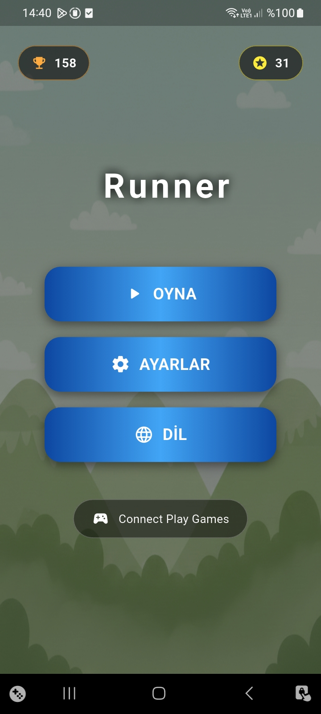
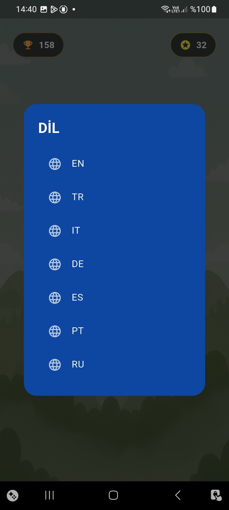
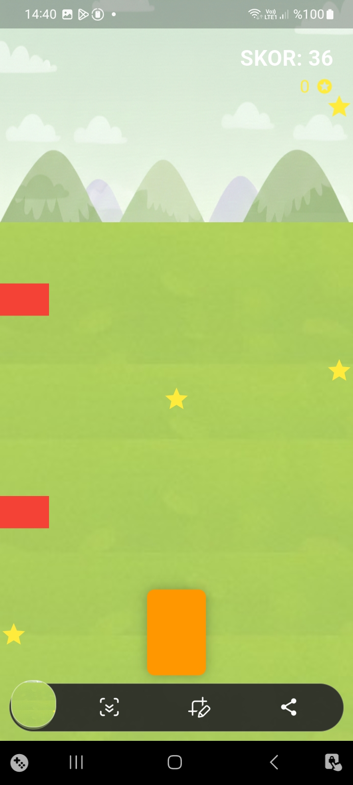
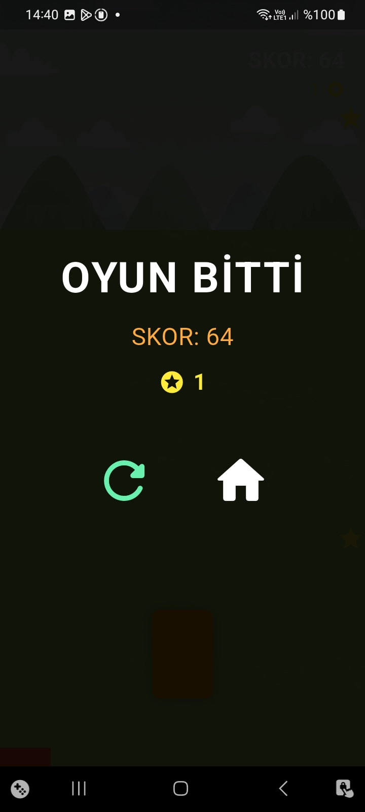

# Runner Mobil Game

Flutter ile geliştirilmiş, dinamik engellere sahip sonsuz koşu oyunu. Akıcı mekanikler ve çoklu dil destekli bir projedir.

##  Ekran Görüntüleri

   
   
   
  

##  Bilgiler
- **Framework:** Flutter
- **Veri Saklama:** `Shared Preferences` (Skor ve Altın yönetimi)
- **Dil Yönetimi:** JSON tabanlı `LocalizationService`
- **Arayüz:** `flutter_screenutil` ile tüm ekran boyutlarına tam uyum

##  Özellikler
* **Sonsuz Döngü:** Oyun yandığınız ana kadar devam eder ve kademeli olarak zorlaşır.
* **Yüksek Skor Sistemi:** En iyi skorunuzu otomatik olarak cihaz hafızasına kaydeder.
* **7 Dil Desteği:** Türkçe, İngilizce, Almanca, İspanyolca, İtalyanca, Portekizce ve Rusça dilleri arasında anlık geçiş.
* **Dinamik Kontroller:** Mobil cihazlar için optimize edilmiş, kaydırma hareketlerine duyarlı kontrol sistemi.
